# 观真 · ALETHEIA

**以自研 SAEv1、SAEv2 伪造检测模型为核心特色的图像伪造检测平台。**

观真面向图像伪造与篡改线索核查，将自研模型与多模型联合研判、可疑区域可视化、检测历史回看整合为完整的网页使用流程。

[English](docs/README.en.md) · [使用说明](docs/USAGE.md) · [文件清单](docs/FILE_INVENTORY.md) · [部署指南](docs/CLAUDE_DEPLOY.md)

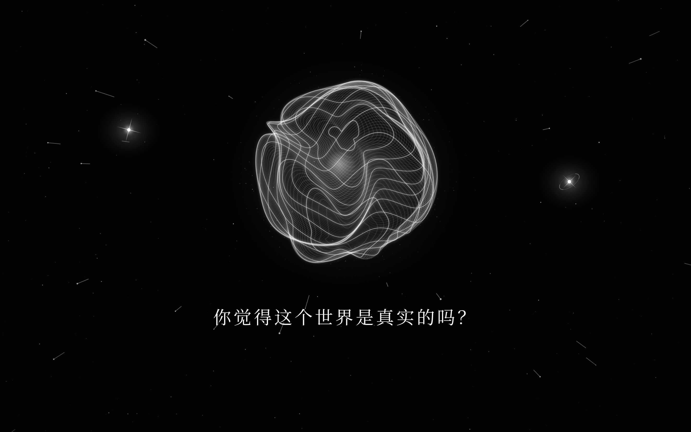

> **交付范围：**本项目包含 React 前端、Flask API、任务队列、SQLite 数据库和既有模型适配层。真实鉴别依赖仓库外的推理程序与权重；文字回复依赖另行配置的大模型服务。界面可独立启动，真实模型效果、耗时和 GPU 资源需求仍须在目标服务器验收。

## 目录

- [产品定位](#产品定位)
- [核心特色](#核心特色)
- [功能与边界](#功能与边界)
- [用户流程](#用户流程)
- [界面预览](#界面预览)
- [快速开始](#快速开始)
- [技术架构](#技术架构)
- [数据与会话](#数据与会话)
- [交付验收与后续方向](#交付验收与后续方向)
- [文档导航](#文档导航)
- [参与维护](#参与维护)
- [许可证](#许可证)

## 产品定位

观真的核心任务是**图像伪造检测**：帮助用户发现图片中的可疑伪造与篡改迹象，并结合模型分数和区域响应进行初步研判。**自研 SAEv1 与 SAEv2 是项目的核心模型特色**，与 Mesorch、MesorchP、TruFor 共同参与现有检测管线。

产品围绕“上传图片—伪造检测—证据查看—历史回看”组织体验，让自研模型成果能够被直接使用和展示；文字对话是辅助功能。

| 目标角色 | 核心任务 | 产品提供的价值 |
| --- | --- | --- |
| 图像核查用户 | 判断一张图片是否存在可疑篡改迹象 | 一次上传，集中查看多模型判断与可视化证据 |
| 研究与演示人员 | 展示已有模型的推理流程与差异 | 统一入口、模型切换、结果回看与清晰的失败提示 |
| 部署与维护人员 | 把现有推理程序稳定接入网页 | 独立 Web 层、串行推理队列、私有产物访问和清理工具 |

以上角色是基于当前能力整理的目标场景，不代表已经完成用户研究或效果验证。当前产品不包含模型训练、批量处理、账号体系或跨设备同步。

## 核心特色

### 自研伪造检测模型 SAEv1 与 SAEv2

**SAEv1、SAEv2 均为项目自研的图像伪造检测模型**，承担图像级伪造评分与区域响应输出，是观真区别于通用模型展示网页的核心特色。界面支持分别查看两套模型的分数、热力图与二值掩码，便于观察各自对同一张图片的判断。

当前 Web 仓库负责模型接入和结果呈现，自研模型定义、训练代码与权重由外部模型项目管理。原管线未返回 SAEv1 分数时，页面显示“未返回”，其区域产物仍按实际输出展示；模型效果及版本间差异需以真实评测为依据。

### 多模型联合研判

自研 SAEv1、SAEv2 与 Mesorch、MesorchP、TruFor 共同提供检测证据，主判决沿用现有管线的多数投票。用户可以逐个查看模型输出，了解不同模型的判断差异。YOLO 提供目标框产物，不参与真伪投票。

### 从检测结论到可疑区域

结果页将图像级判决与原图、热力图、二值掩码放在同一查看流程中，支持模型切换和叠加透明度调整，帮助用户观察模型关注的位置。区域响应表示模型线索，不等于已经证实的篡改区域。

### 可回看的检测流程

上传后异步执行检测，展示真实任务状态，并保存检测记录与产物。用户可在当前浏览器会话的历史中重新查看结果、比较模型输出或删除已结束的任务。

## 功能与边界

| 功能 | 当前实现 | 使用前提与限制 |
| --- | --- | --- |
| 图片选择与预览 | 点击或拖拽选择静态 JPG、PNG、WebP | 默认最大 10 MiB、1600 万像素；服务器校验真实文件内容 |
| 异步伪造检测 | 提交任务后查询排队、运行、完成或失败状态 | 需接入既有模型；单线程推理，默认最多容纳 8 个未结束任务 |
| 结果查看 | 多数投票判决、5 个鉴别模型分数、原图、热力图和二值掩码 | 自研 SAEv1、SAEv2，以及 Mesorch、MesorchP、TruFor；缺失分数显示“未返回” |
| 图像证据比较 | 切换模型与视图，调整热力图叠加透明度 | YOLO 目标框产物由后端保存，当前界面主要呈现上述 5 个鉴别模型 |
| 文字对话 | 异步回复、保存消息、恢复对话 | 需配置 Chat Completions 兼容服务；不自动读取图片或鉴别结果 |
| 历史管理 | 分页查看、恢复、删除鉴别与对话记录 | 按浏览器 Cookie 隔离；运行中的任务或回复暂不能删除 |
| 部署与维护 | 单端口托管、健康接口、静态接入检查、到期清理 | 清理需主动执行或配置定时器；健康接口不等于真实推理验收 |

### 结果如何理解

- 分数表示各模型的伪造倾向，**不是经过校准的真实性概率**，也不合成为新的“综合置信度”。主判决沿用既有管线的多数投票。
- Mesorch 系列采用中心裁切，不能把拉伸后的热力图理解成完整覆盖所有边缘的精确定位。
- TruFor 不可用时，既有管线可以降级为其余 4 个鉴别模型；核心推理或必要产物失败时，任务标记为失败。
- 不生成随机分数、模拟热力图或虚构回复来替代真实服务输出。测试中的固定夹具仅用于自动化验证。

## 用户流程

1. 打开首页，点击中央光球，再选择“图像鉴别”入口。
2. 选择或拖入图片，检查预览，点击“开始鉴别”。模型未接入时只能预览。
3. 等待真实任务状态更新；已成功提交的任务在关闭面板后仍会继续，可从历史恢复查看。
4. 查看判决，切换不同模型的分数、原图、热力图和掩码。
5. 通过“记忆之星”回看或删除历史；通过“对话之星”进入独立的文字对话。

操作细节、错误处理与配置方法见[使用说明](docs/USAGE.md)。

## 界面预览

以下检测截图来自提供的 `aletheia-real-results` 实测素材，样本名称、模型分数与随附[推理记录](docs/real-results/inference_results.json)对应；样本来源见[素材清单](docs/real-results/MANIFEST.md)。这些是具体样本的运行结果，不代表完整数据集上的准确率或性能基准。

### 自研 SAEv1：拼接伪造检测

CASIA v1 拼接样本 `casia1_splice_plants.jpg` 的真实结果。当前选中 **SAEv1**，伪造分数为 **76.74%**；同一任务中 SAEv2 为 **63.61%**，最终 **3/5** 个模型认为存在伪造特征。热力图展示 SAEv1 对图像区域的响应。


### 自研 SAEv2：未篡改样本检测

CASIA v1 未篡改样本 `casia1_authentic_nat.jpg` 的真实结果。当前选中 **SAEv2**，伪造分数为 **22.44%**，最终 **0/5** 个模型认为存在伪造特征，界面显示“暂未发现明显异常”。未篡改样本也可能出现热力响应，不能仅凭热力图颜色认定存在篡改。


<details>
<summary>查看多模型对比与真实场景样本</summary>

同一 CASIA 拼接样本切换到 TruFor，伪造分数为 **98.15%**，可与上方 SAEv1 的区域响应对照。

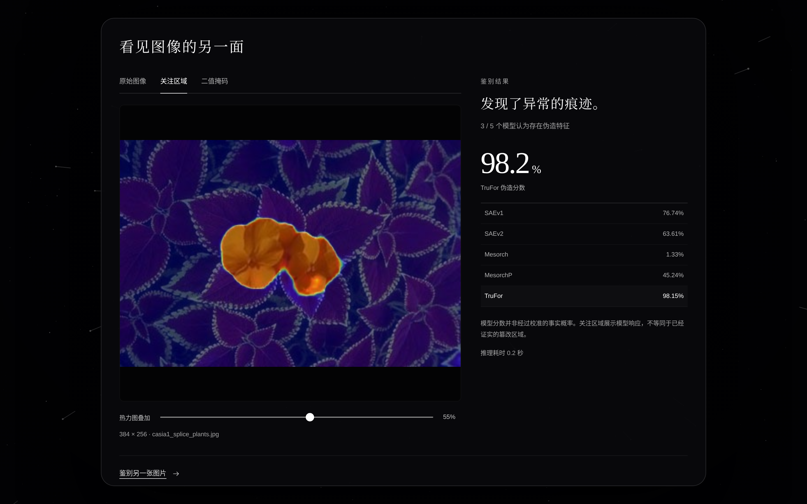

IMD2020 样本 `imd2020_realworld_01.jpg` 在清单中标记为现实场景收集的篡改图片。下方“原始图像”指本次上传的待检测图片，并非未篡改原版。该任务 SAEv1、SAEv2 分数分别为 **80.94%**、**53.52%**，TruFor 为 **93.29%**，最终 **3/5** 票认为存在伪造特征。

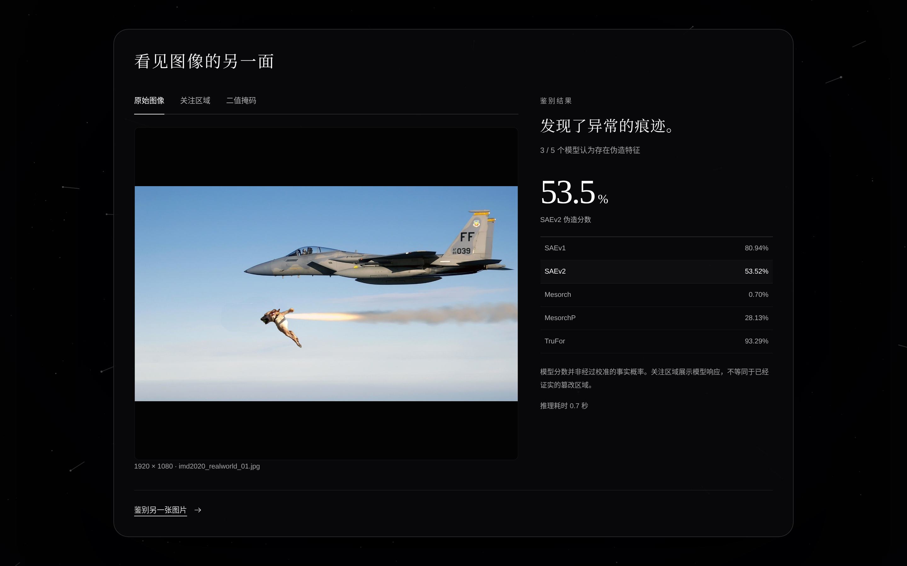

| TruFor 热力图叠加 | TruFor 二值掩码 |
| --- | --- |
| 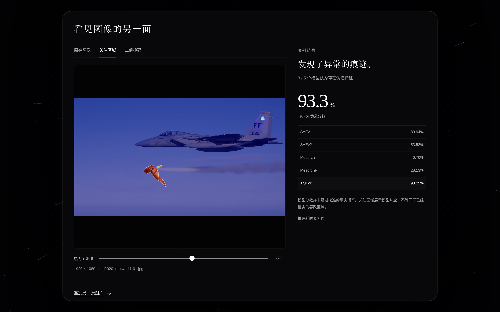 | 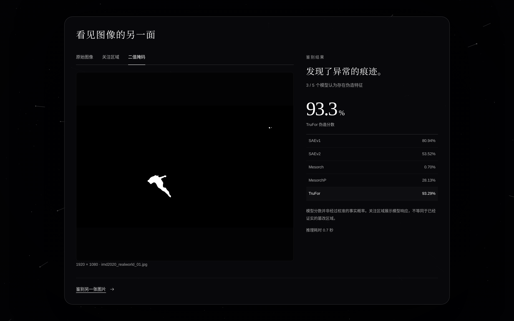 |

</details>

### 上传与历史

首页、上传、历史及移动端截图已同步使用本次提供的实际界面素材；文字对话保留原项目实际截图。

| 图像鉴别入口 | 图片预览 |
| --- | --- |
| 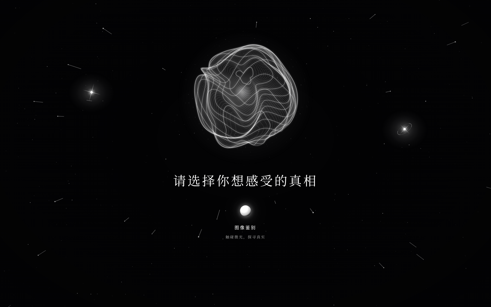 | 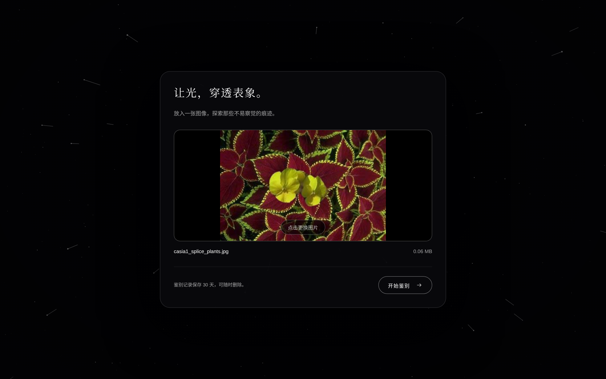 |

| 文字对话 | 真实检测历史 |
| --- | --- |
| 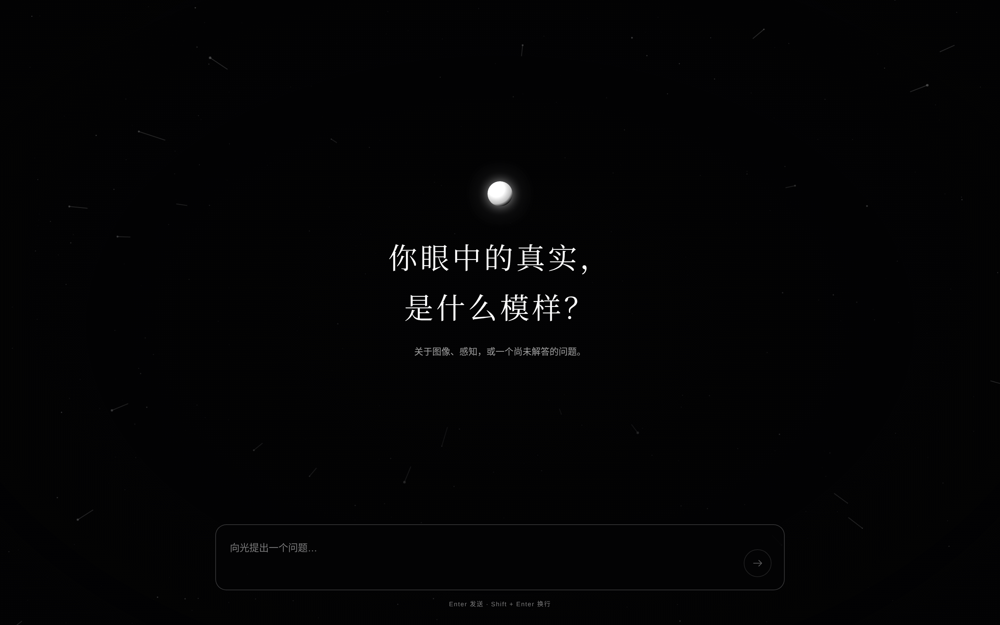 | 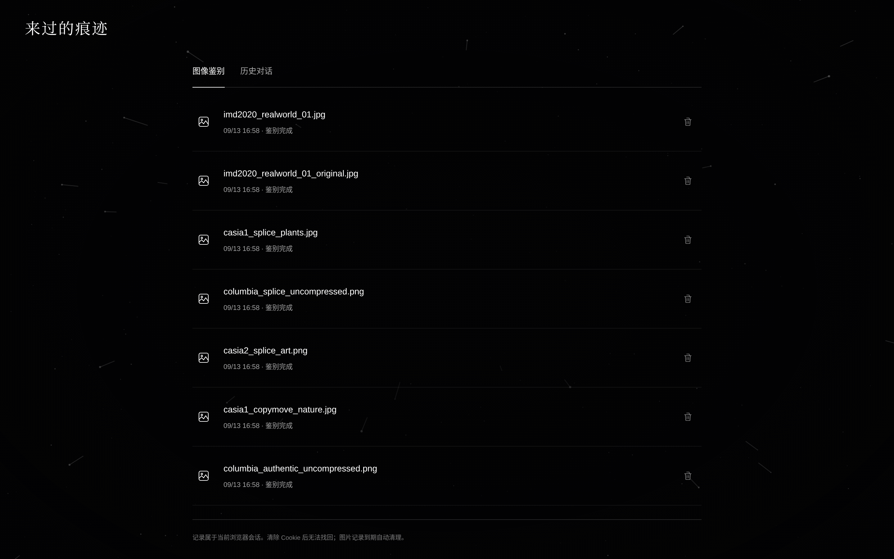 |

<details>
<summary>查看星辰导航与移动端截图</summary>

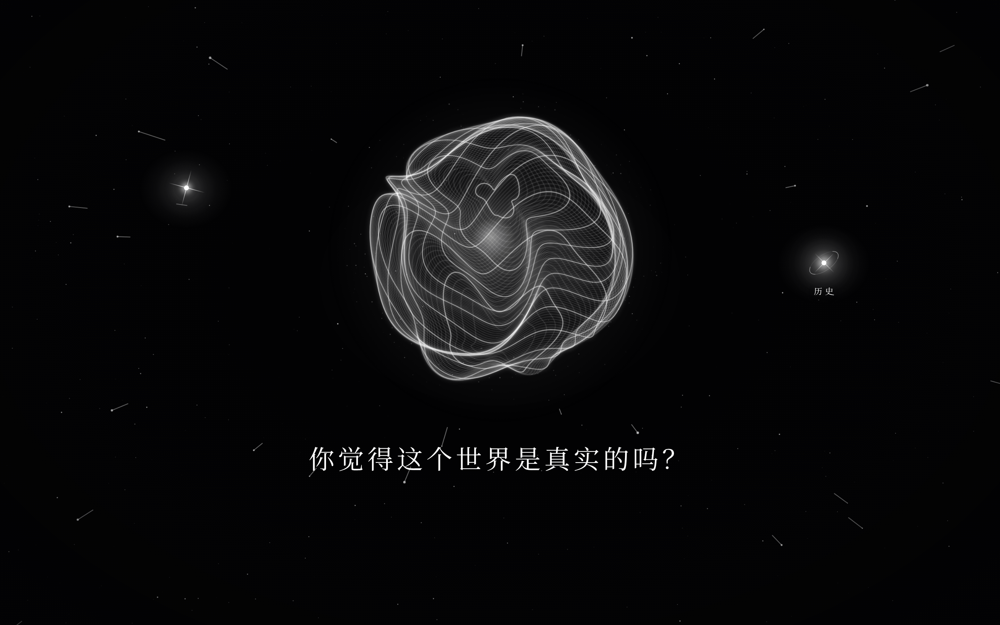

| 移动端首页 | 移动端检测历史 |
| --- | --- |
|  | 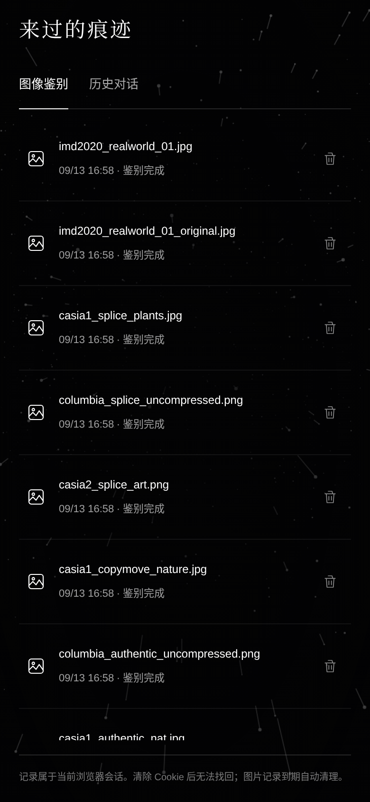 |

</details>

## 快速开始

以下命令在项目根目录执行。Web 层需要 Python 3.10+；当前交付包含 `web/dist/`，仅运行页面无需 Node.js 或本地 GPU。

```bash
python3 -m venv .venv
source .venv/bin/activate
python -m pip install -r requirements-web.txt
cp .env.example .env
python app.py
```

如果已有 `.env`，保留现有配置，不要重复覆盖。Windows 的虚拟环境激活命令见[使用说明](docs/USAGE.md#本地启动)。

打开 [本地首页](http://127.0.0.1:6006)。未找到 `LEGACY_ROOT` 下的入口文件时，页面可以预览图片、保存文字消息，但不能执行真实鉴别或产生未配置的模型回复。`LEGACY_ROOT` 默认是 `/root/autodl-tmp/sys_all`。

建议在 `.env` 中设置固定的 `SECRET_KEY`，避免开发服务重启后已有 Cookie 失效。生产环境要求该值不少于 32 个字符。

```bash
python3 -c "import secrets; print(secrets.token_hex(32))"
```

### 修改前端

前端使用 React 19 与 Vite 7。沿用项目的 Node.js 22.12+ 环境约定，准备好 Corepack/pnpm 后执行：

```bash
cd web
corepack pnpm install --frozen-lockfile
corepack pnpm run dev
```

同时保持 Flask 运行；Vite 已将 `/api` 代理到 `127.0.0.1:6006`。开发完成后执行 `corepack pnpm run build` 更新 `web/dist/`，由 Flask 统一托管。

### 接入服务器

先阅读[部署指南](docs/CLAUDE_DEPLOY.md)，配置模型目录、固定密钥、数据目录和实际访问来源，再执行：

```bash
python3 preflight.py
APP_ENV=production bash deploy/start.sh
```

静态检查不加载权重，通过后仍需用真实图片验收。启动脚本固定监听 `0.0.0.0:6006`，使用 1 个 Gunicorn worker；不要增加 worker，也不要启用 `--preload` 或 `--reload`。

## 技术架构

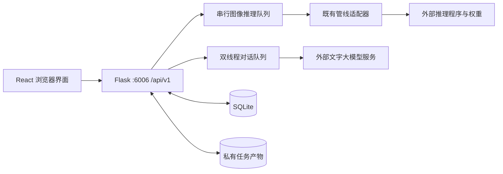

Flask 同时提供前端构建产物和 API。图像推理采用进程内队列，结果持久化到 SQLite；服务重启会把未结束的任务标记为失败，不会自动续跑。

适配器保留既有模型架构、权重加载和投票逻辑，同时设置推理模式、限制 TruFor 输入长边，并将输出重定向到任务私有目录。这些处理可能影响结果，应在服务器上与旧管线进行对照验证。

```text
aletheia/
├── README.md             # 产品概览与文档入口
├── app.py                # Web 应用入口
├── server/               # 配置、数据库、队列与模型适配
├── web/                  # 前端源码与构建产物
├── deploy/               # 启动脚本与 systemd 模板
├── tests/                # API 和结果规范化测试
├── docs/                 # 使用、交接、设计与技术文档
├── preflight.py          # 模型接入前静态检查
└── cleanup.py            # 到期鉴别任务清理
```

逐文件职责、修改入口和交付范围见[文件清单](docs/FILE_INVENTORY.md)。

## 数据与会话

- 访问页面即可建立访客会话，目前没有登录或访问密钥门禁。任务、图片与对话按 Cookie 对应的访客身份隔离。
- 更换浏览器、清除 Cookie 或更换服务器签名密钥后，原历史不会自动关联到新会话；数据库保存不等于跨设备可恢复。
- 上传图会进行方向校正、RGB 转换和元数据去除，以 PNG 保存。产物通过归属校验后的 API 访问。
- 数据默认位于 `data/`，可通过 `DATA_DIR` 配置。鉴别任务默认在创建后 30 天到期，清理程序仅删除到期且已完成或失败的任务。
- **到期不会自动触发删除。**需手动运行清理脚本或启用定时任务；对话与消息不在该到期清理范围内。
- 大模型密钥只保存在服务端。启用对话服务后，发送给供应商的内容包括最近最多 40 条已完成消息。

## 交付验收与后续方向

### 当前交付验收

| 验收目标 | 通过标准 |
| --- | --- |
| 基础使用 | 首页可访问，浏览器会话正常，上传与历史入口可操作 |
| 真实鉴别 | 实图任务完成，分数与产物来自实际管线，缺失或降级信息正确 |
| 文字对话 | 配置真实服务后回复落库，可恢复会话；未配置时明确提示 |
| 数据隔离 | 两个浏览器会话不能互相读取或删除任务、图片及对话 |
| 异常恢复 | 队列满有明确提示，重启后中断任务标记失败，历史可以读取 |
| 运维闭环 | 清理按计划执行，备份覆盖数据库及图片，恢复步骤经过验证 |

Web 层自动化验证命令：

```bash
python -m unittest discover -s tests -v
```

测试使用固定夹具，不代表真实模型准确率、吞吐量或部署验收通过。完整服务器验收步骤见[部署指南](docs/CLAUDE_DEPLOY.md#8-服务器验收清单必须实际执行)。

### 待评估方向

以下是产品规划建议，尚未实现，也不是交付承诺：

- 先建立真实样本验收集，记录成功率、端到端等待时间与用户对分数含义的理解情况，再制定性能和体验目标。
- 面向持续公开使用，评估用户配额、请求限速、存储监控与告警。
- 出现跨设备需求时引入账号与历史关联；出现更大推理需求时评估独立推理服务和外部队列。
- 根据使用反馈评估批量鉴别、结果导出和鉴别结果辅助对话。

## 文档导航

| 文档 | 适合谁 | 内容 |
| --- | --- | --- |
| [使用说明](docs/USAGE.md) | 用户、开发者、运维 | 启动、操作、配置、故障处理与维护 |
| [文件清单](docs/FILE_INVENTORY.md) | 接手项目的开发者 | 当前交付逐文件说明、修改入口与生成文件 |
| [部署指南](docs/CLAUDE_DEPLOY.md) | 服务器维护人员 | 既有模型接入约束与实机验收 |
| [API 契约](docs/API.md) | 前后端开发者 | 路由、状态、响应格式与错误码 |
| [数据库说明](docs/DATABASE.md) | 后端与运维 | 表结构、迁移、数据保留与备份 |
| [设计说明](docs/DESIGN.md) | 产品、设计、前端 | 视觉、交互与可访问性约定 |
| [English overview](docs/README.en.md) | 英文读者 | 英文项目概览 |
| [旧交接资料说明](docs/source/README_使用说明.md) | 需要了解改造背景的人 | 原始服务器快照的范围与阅读方式 |

## 参与维护

修改前先确认对应的实现与技术文档。提交变更时说明解决的问题、用户可见行为和验证结果；接口、配置或数据策略变化应同步更新文档。修改前端后重新构建，修改后端行为后运行相关测试；模型接入变更还需真实服务器验证。

## 许可证

当前交付目录未包含 `LICENSE` 文件，本文不指定或授予开源许可证。模型程序、权重与第三方依赖的授权范围需分别核实。
