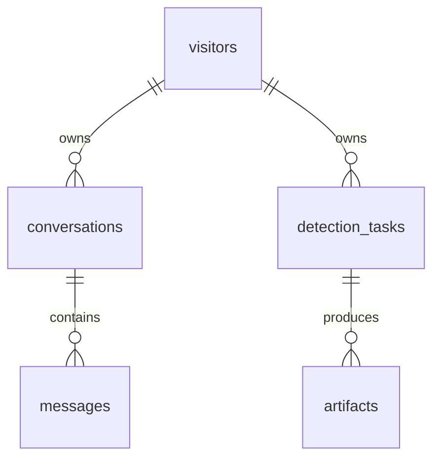

# 数据库与文件存储设计

## 1. 当前选择

交付版本使用 Python 标准库 SQLite，WAL 模式、foreign_keys=ON、busy timeout=10 秒，每次操作建立独立连接，写事务短暂。适合当前「单机、单进程、一个推理 worker」部署，不额外安装数据库服务器，不改动已有 torch 环境。数据库通过 `DATA_DIR/aletheia.sqlite3` 持久保存。

这是一套已实现的数据库，不是只预留类型的前端原型。首次启动自动建表；没有生产密码默认值。将 DATA_DIR 放在数据盘，例如 `/root/autodl-tmp/sys_all/aletheia-data`，不要放在剩余空间有限的 overlay 系统盘。

## 2. 数据关系



### visitors

字段 | 类型 | 规则
--- | --- | ---
id | TEXT PK | 随机 UUID，存于服务器签名 Cookie
created_at | TEXT | UTC 创建时间
last_seen_at | TEXT | 最近建立/刷新会话的时间

这是浏览器访客身份，**不是完整账号体系**。不同浏览器/无痕窗口无法查看彼此记录。清除 Cookie 或更换 SECRET_KEY 会失去对应记录入口；暂不支持找回、跨设备同步或邮箱登录。日后若增加用户账户，新增 users 表及受验证的身份关联，不可用前端传入的 user_id 替代 Cookie 校验。

### conversations

`id` TEXT PK；`owner_id` 外键；`title` TEXT（首条问题前 24 字）；`created_at`、`updated_at` UTC 时间。索引 `(owner_id, updated_at DESC, id DESC)` 用于历史列表。删除 owner 时级联。

### messages

字段 | 类型 | 规则
--- | --- | ---
id | TEXT PK | UUID
conversation_id | TEXT FK | conversations.id，删除会话级联
role | TEXT | user / assistant
content | TEXT | 用户最多 4000 字；回复截断至最多 24000 字
status | TEXT | pending / running / completed / failed
model | TEXT nullable | 提供商配置的模型名称
error_code | TEXT nullable | LLM_NOT_CONFIGURED / LLM_FAILED / SERVER_RESTARTED
created_at | TEXT | UTC 时间
sequence | INTEGER | 会话内严格递增序号，UNIQUE(conversation_id, sequence)

创建一轮时用 `BEGIN IMMEDIATE` 检查无运行中回复，写 user 和 assistant 占位两条记录，sequence 为现有消息数 +1、+2。不会按相同毫秒的 UUID 随机排序。当前没有独立消息删除 API，所以序号不会复用。最多 400 条/会话。

### detection_tasks

字段 | 类型 | 规则
--- | --- | ---
id | TEXT PK | UUID，亦为专属文件目录名
owner_id | TEXT FK | visitors.id
filename | TEXT | 去除路径，最多 180 字；仅用于展示
status | TEXT | queued / running / completed / failed
image_width / image_height | INTEGER | 方向校正后的像素尺寸，必须 >0
image_sha256 | TEXT | 原上传内容摘要；用于追溯，不作为全局去重依据
input_path | TEXT | DATA_DIR 下相对路径，不向前端暴露
result_json | TEXT nullable | 完整结果，JSON 序列化
error_code / error_message | TEXT nullable | 对外可展示的结构化失败信息
created_at / started_at / finished_at | TEXT | 后两者可空
expires_at | TEXT | 创建时间 + RETENTION_DAYS（默认 30 天）

索引 `(owner_id, created_at DESC, id DESC)` 用于历史查询，`expires_at` 用于清理。任务状态和原图索引先落盘，再加入有界线程队列。任务结果与所有产物索引在一次事务中提交。

`result_json` 包含五模型 scores（不可用为 null）、既有 majority vote 判定、耗时、版本、降级标记、限制说明和产物 URL。SQLite 不单独分模型表，避免过早增加运维复杂度；将来做统计报表可迁移为 detection_model_results 子表，并保留原始结果快照。

### artifacts

`id` TEXT PK；`task_id` 外键；`kind` 是 original / heatmap / mask / yolo；`model` 可空；`relative_path` 为私有存储相对路径；`mime_type` 与 `created_at`。索引 task_id。删除任务级联删除数据库记录，应用同时清除对应 UUID 文件目录。

### schema_version

version INTEGER PK，applied_at UTC。初始化 SQL 定义 v1；`server/db.py` 自动迁移 v2，给 messages 添加 sequence 并回填。v2 是当前要求版本。升级数据库前做备份。禁止把已有数据库删除重建作为迁移方式。

## 3. 文件布局与隐私

```text
DATA_DIR/
├── aletheia.sqlite3
├── aletheia.sqlite3-wal
├── aletheia.sqlite3-shm
└── tasks/
    └── <task-uuid>/
        ├── input.png
        └── results/
            ├── heat_v2_....jpg
            ├── mask_v2_....jpg
            └── ...
```

不以原始文件名创建可碰撞的存储路径。原图方向校正、移除 EXIF 后另存 PNG。文件路径只在服务器内部使用，浏览器只持有随机 artifact_id。访问产物时 JOIN 任务 owner_id 鉴权，检查解析后的绝对路径仍在 DATA_DIR 内，返回 no-store。

## 4. 生命周期、重启与一致性

- 有界推理队列容量默认 8（包含运行中的任务），线程数固定 1；聊天有独立线程池 2，容量 8。
- 进程启动时将未完成图片任务和聊天回复标为 SERVER_RESTARTED。任务不会悄悄重新推理、重复占用显卡。
- 运行中的任务不可删除；已完成或失败任务可删除。文件删除发生在数据库记录删除前，如果文件系统异常则保留数据库记录并报错，便于重试。
- `cleanup.py` 只读取 DB，清理到期且完成/失败的任务，绝不创建 Web 应用或启动模型。这样后台清理不会把实际正在运行的任务误标为中断。
- 提供每日 systemd timer；自动清理仅在服务器安装 timer 后生效。本地可手动 `python cleanup.py`。
- 对话记录默认保留直到用户删除；目前不自动清理空 visitors。公开长期运营前应新增访客/对话 TTL、配额及审计要求。
- 文件系统与 SQLite 无跨介质事务，崩溃可能留下没有 DB 记录的 UUID 孤立目录。日后可做只扫描 DATA_DIR/tasks 的孤立文件回收；交付版本不冒险删除无法确认归属的文件。

## 5. 备份与恢复

使用 SQLite Online Backup API 或停服务后复制数据库与任务目录。运行时直接复制主 `.sqlite3` 而漏掉 WAL 可能产生不一致，不能作为可靠备份。

最简单的服务器备份方式：停止本产品进程（不删除任何文件），把整个 DATA_DIR 复制到另一位置，再启动；保存 SECRET_KEY，以便旧 Cookie 继续有效。备份目录权限应与原数据一致。恢复后检查任务计数、随机抽查原图和热力图，并确认队列没有复用过期任务。

## 6. 何时再引入 PostgreSQL

当前交付**没有 PostgreSQL 连接器，也不声称修改 DATABASE_URL 就可以切换**。若未来需要多实例、多用户配额、复杂查询，应明确迁移：使用 UUID/TIMESTAMPTZ/JSONB，迁移已有 owner_id 和 sequence，保持唯一约束、删除级联及所有权查询；推理同时需要独立的单 GPU worker / 外部任务队列，不能只把 Gunicorn 扩大到多个 worker。SQLite 文件不要放到 NFS 共享盘。

参考实现依据：[Python sqlite3 文档](https://docs.python.org/3/library/sqlite3.html)。
