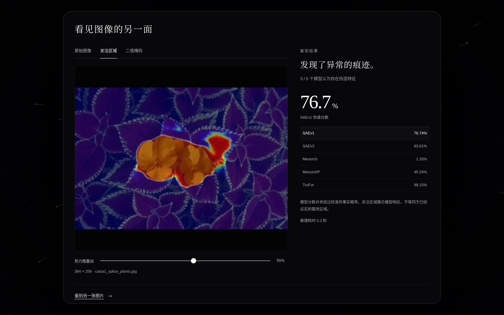
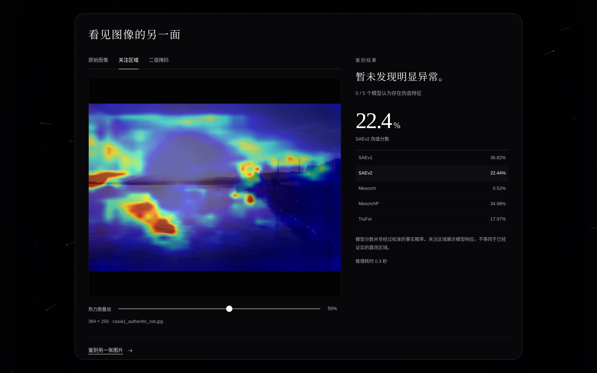
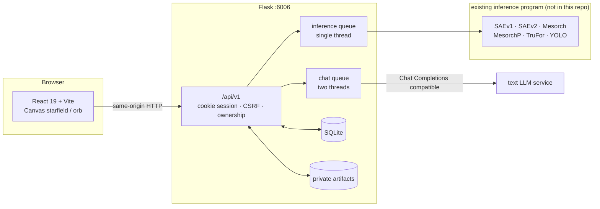

# ALETHEIA · Image Forensics Web System

[简体中文](../README.md) · English

> This English overview is retained from the original README. For the detailed operating guide and file inventory, see [Usage](USAGE.md) and [File inventory](FILE_INVENTORY.md) (Chinese).


## What this is

ALETHEIA is an **image forgery detection platform featuring the project’s in-house SAEv1 and SAEv2 models**. These two models are a defining feature of the project and participate in the existing detection pipeline alongside Mesorch, MesorchP and TruFor. Users can inspect per-model scores, heatmaps and masks, then revisit detection history. Text conversation is a supporting feature.

The frontend carries the experience; a Flask backend owns sessions, the job queue, private artifacts and the database, and calls the server's existing multi-model inference program through a thin adapter. The models, weights and training work are outside this repository — what this repository solves is turning those models into a usable, deliverable, operable website.

The whole system lives on one port: Flask serves both the built frontend and the `/api/v1` endpoints on `6006`. No CORS setup, and no Node.js needed on the server.

## User flow

1. The home page asks one thing: **do you think this world is real?** Click the central orb.
2. The line changes to **choose the truth you want to feel**, and a small *image detection* orb appears below.
3. Click the small orb, then upload or drop a JPG / PNG / WebP image.
4. The image enters an async queue. The page polls real state (queued / running / completed / failed) and, once done, shows each model's forgery score, the original image, the heatmap overlay and the binary mask.
5. Two stars are the whole navigation: the *conversation star* opens fullscreen chat, the *memory star* opens fullscreen history, where earlier detections and conversations can be restored or deleted.

Real detection screenshots supplied in `aletheia-real-results` are shown in the [Chinese README gallery](../README.md#界面预览), alongside the updated upload and history screens. Scores match the accompanying [inference records](real-results/inference_results.json); dataset provenance is recorded in the [sample manifest](real-results/MANIFEST.md). These are individual examples, not a dataset benchmark.

### In-house SAEv1: splicing detection

On `casia1_splice_plants.jpg`, SAEv1 returns a forgery score of **76.74%** and SAEv2 **63.61%**, with **3/5** forgery votes. The selected heatmap below is SAEv1's actual output.



### In-house SAEv2: authentic sample

On `casia1_authentic_nat.jpg`, SAEv2 returns **22.44%**, with **0/5** forgery votes. Heatmap responses can also occur on authentic images; color alone does not establish manipulation.



## Architecture



Inference runs **serially on one background thread**. Concurrency is never raised by adding workers; a full queue returns 429 while health checks and the page stay responsive.

## Design stance

- Pure black background `#030304`, panels `#09090c`, all page text white, hierarchy expressed through white opacity.
- Serif CJK family for headings, system sans for UI. No external fonts, CDNs or analytics.
- Navigation is two stars, chat and history, whose names appear only on hover or keyboard focus; a corner "return star" closes each panel.
- Upload and results are centered dialogs; chat and history are fullscreen panels. Thin white borders, no colored badges, no stacked cards.
- Model heatmaps keep their original JET colormap and originals keep their own colors — visual consistency never overrides the meaning of image evidence.
- No flashing, no automatic sound. The system reduced-motion preference is honored, and drawing pauses in background tabs and while a panel is open.
- Every control is a real `button` / `input`; dialogs support Escape, focus trapping and focus restore; decorative stars stay out of the accessibility tree; state is announced through `aria-live`.

## Honest boundaries

Part of the design, not a disclaimer:

- **No random scores or generated heatmaps stand in for detection results.** Without a connected model you can still preview an image, and the interface says plainly what is connected.
- With no LLM configured, user messages are still saved and the reply slot shows a system note explicitly marked as failed — never fabricated model output.
- Scores are per-model forgery tendencies, not calibrated authenticity probabilities. There is no hand-assembled "overall confidence". The verdict remains the original pipeline's majority vote.
- Fields the original pipeline does not return (such as the SAEv1 score) display as *not returned* rather than being guessed.
- Elapsed time is never dressed up as a progress percentage; only real upload progress and task state are shown.

## Security and data

- Sessions are identified by a signed, HttpOnly, `SameSite=Lax` cookie. The LLM key stays server-side and never reaches the browser.
- Writes validate `X-CSRF-Token` and Origin. Tasks, conversations and images are authorized by `owner_id`; cross-session access returns 404 rather than revealing that a resource exists.
- Image format is decided by content, not extension; EXIF orientation is applied, then the image is stored as lossless PNG with metadata stripped. Defaults cap at 10 MiB / 16 M pixels.
- Artifacts stream through an authorized `/api/v1/artifacts/{id}`. There is no anonymous static mapping.
- Data lives in a separate `DATA_DIR`. Detection tasks expire 30 days after creation by default; scheduled or manual cleanup removes expired completed / failed tasks. Conversations are not included in this cleanup policy.

## Quick start

Python 3.10+. torch is not required to explore the interface and history database:

If `.env` already exists, keep it instead of overwriting it. Set a fixed `SECRET_KEY` to preserve visitor cookies across development restarts.

```bash
python -m pip install -r requirements-web.txt
cp .env.example .env
python app.py
```

Open <http://127.0.0.1:6006>. `web/dist/` ships prebuilt, so no Node.js is needed to run it. Inference is unavailable when the configured legacy entry file is missing. The default `LEGACY_ROOT` is `/root/autodl-tmp/sys_all`.

To change the frontend you need Node.js 22.12+:

```bash
cd web
corepack pnpm install --frozen-lockfile
corepack pnpm run build
```

In production Flask serves `web/dist` on 6006; `pnpm run dev` is for local development only.

## Deployment

**Start with [docs/CLAUDE_DEPLOY.md](CLAUDE_DEPLOY.md)** — the integration route that leaves existing models untouched, the invariants, environment variables and an acceptance checklist.

```bash
python3 preflight.py      # read-only static check, loads no models
APP_ENV=production bash deploy/start.sh      # single worker + gthread, binds 0.0.0.0:6006
```

`deploy/` also carries a systemd unit and a daily cleanup timer. Generate `SECRET_KEY` with `python3 -c "import secrets; print(secrets.token_hex(32))"`. Keys belong only in the server's `.env`, never in the repository — `.gitignore` already excludes `.env`.

## Tests

```bash
python -m unittest discover -s tests -v
```

Covers upload validation, queue capacity, private-artifact authorization, chat persistence, cross-session isolation, CSRF / Origin checks and expiry cleanup. Tests inject explicit inference fixtures; production code has no automatic mock fallback.

## Documentation

| Document | Contents |
| --- | --- |
| [docs/CLAUDE_DEPLOY.md](CLAUDE_DEPLOY.md) | Deployment and model-integration brief, acceptance checklist |
| [docs/API.md](API.md) | API and data contract, error codes |
| [docs/DATABASE.md](DATABASE.md) | Schema, ownership, retention, backup |
| [docs/DESIGN.md](DESIGN.md) | Interface conventions and accessibility |

## About the models

The multi-model inference program, its weights and its evaluation are out of scope here. `server/legacy.py` loads the existing entry point through importlib, leaves the original preprocessing, conflict correction and majority vote untouched, writes artifacts into per-task private directories, and never modifies the original weights or `static/` directory.

Note: documents under `docs/` are written in Simplified Chinese, matching the deployment handoff they were produced for.
